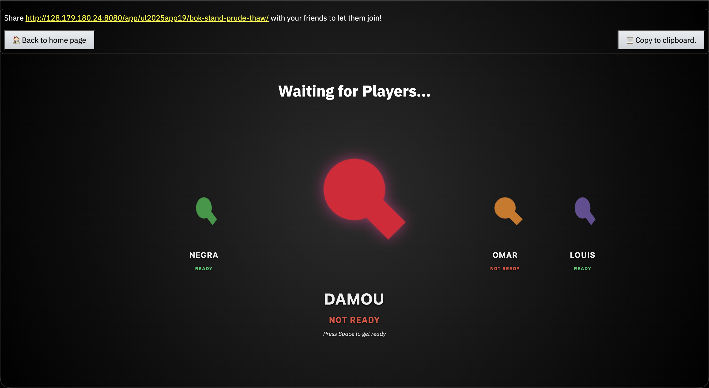
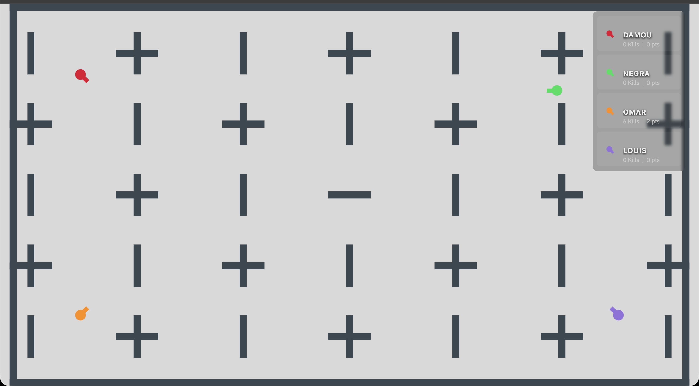
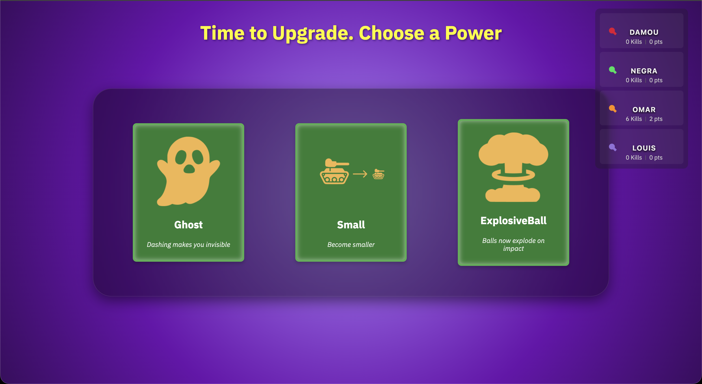
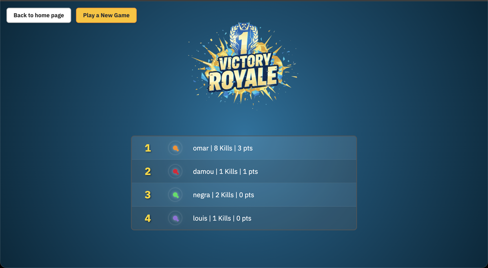
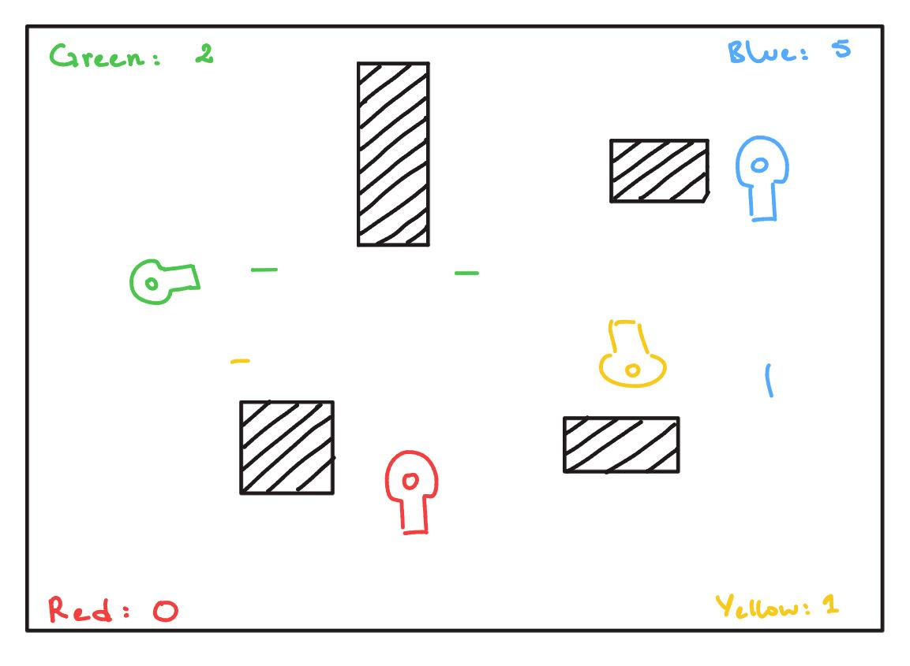
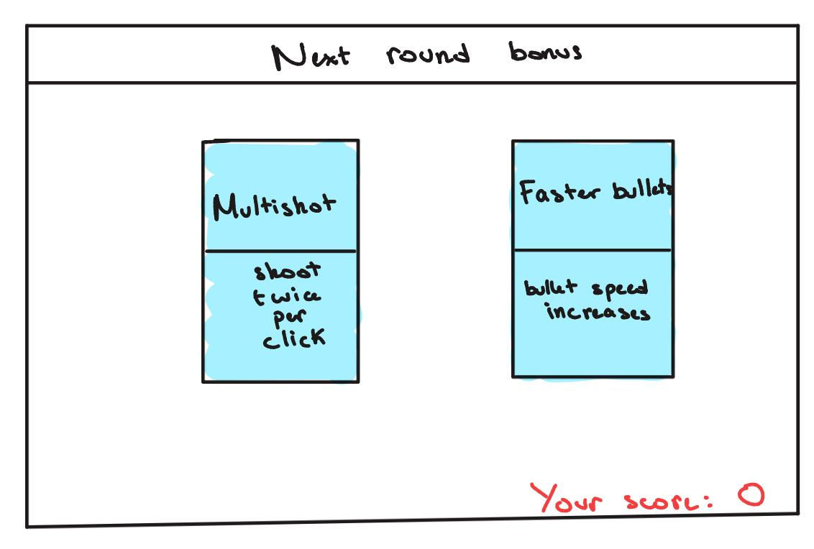

## EPFL Battle Labs


## Description
EPFL Battle labs is a game created as part of the Unguided Lab of CS-214 course in the fall semester 2025. 

It's a 2D shooting arcade game, where each player owns a tank and has one mission: to be the last one to survive. If he succeeds, the player wins the round and earns 1 point. The first to get 3 points wins the game!  
Before beginning a new round, each player can select one power to either make them stronger or make the ennemies weaker. They will keep this ability until the end of the game.  
Each round takes place on a map selected from a large map pool where walls, turrets and bots will make the players' survival difficult.

The game's design and basic functionnality is inspired by https://diep.io/. 
The powers and Battle Royale system is our personal touch and is what makes this game exceptionnally fun!

## Visuals






## Installation
To run the project, ensure that scala is correctly installed on your computer (follow the instruction on the [Scala Website](https://docs.scala-lang.org/getting-started/install-scala.html)).  
Open terminal in the root file and run 
```
sbt run
```

You can then connect via your web browser at address 
```
http://localhost:8080
```

## Usage
Once the game has started and you've connected to port 8080 in your web browser, you can start a game by clicking on the EPFL Battle Lab image. The party owner has to instantiate the players name, separating it with a coma. Here is an example of a valid instantiation:

```
Player1,Player2,Player3,Player4
```
**Important**: The game cannot support more than 4 players

Select one player and press _Enter_ or the _Join!_ button to create the game. You can click on the _Copy link_ button and share the link with the other players.

**Important**: All players must be connected to the same network for the connection to be successful.

Each player has to select their name and press _Enter_ or the _Join!_ button to join the lobby. The game starts when each player is ready. To get ready, a player must press _Space_.

Once the game starts, each player can move freely using _W_ or _Z_ to go up, _A_ or _Q_ to go left, _S_ to go down and _D_ to go right. Players can shoot a bullet using _J_, and dash using _K_.

When one player alone remains alive, they are granted a point, the round ends, and each player has to select a bonus for themselves (green boxes) or a penalty for all other players. Powers and penalties can be selected by clicking on them (one cannot revoke their choice). Once every player has made their selection, the next round begins.

The first player to reach 3 points win. 


## Authors and acknowledgment
Adam Negra, Adam Damou, Omar Jamoussi, Louis Daffaud

## Proposal - ICShooter.io
### User stories
As a player, when everybody connects or after a certain time, I want to play against my friends for a certain number of rounds.
As a player, during a round, I want to be able to move and shoot at my friends using the keyboard.
As a player, when a round is finished, I want to select a new power without other players knowing my choice.
As a player, when the game ends, I want to be informed of the score of each player and the winners.

### Requirements
When each player is connected, the game starts. When the game has started, each player can choose among 2 powers from a list of predefined powers (for instance some powers might make the ammunition explode on impact, the ability to dash, increase the shooting rate, the player speed, …). He should then be able to move freely around a map using keys (w, a, s, d). He can also shoot a laser using the "space" key. His actions should be impacted by the powers he has selected. When a player is touched by a laser he should be killed. When there is only one player alive, he wins the round. At the end of the round each player can select a power. The first player to win 3 rounds wins the game.

Each round is played in a map taken from a predefined map pool. At the beginning of the round, each player spawns in predefined spots. The map is made of various obstacles that stop the bullet and player movements.

The game should be clock-based: when a key is pressed by any of the players, the event is put into a set of all events that occurred during this clock cycle. At each clock tick, a transition of state occurs, taking into account the various inputs that occur during the elapsed time of the clock. At this time, player position, laser position and game state are updated.

### Roles
Adam Damou: UI   
Omar Jamoussi: Integration and Tests  
Adam Negra: Game logic  
Louis Daffaud: Game logic

### Mock-ups




